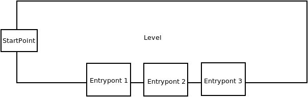
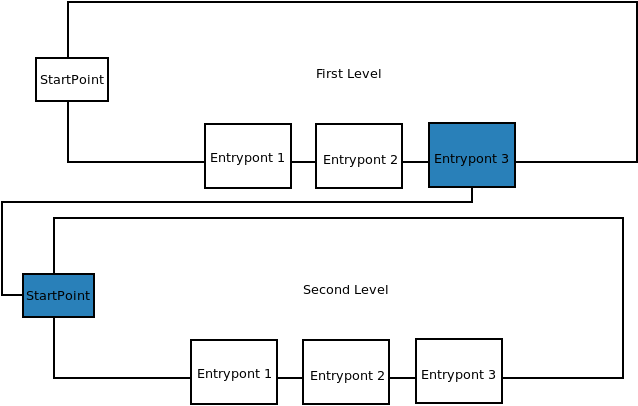
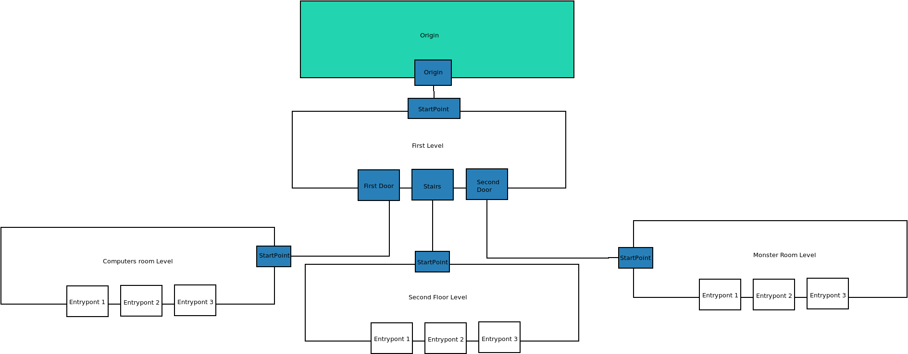

Backbone Game Levels Structure
==============================

Story
-----

A Game can also be represented as a Story. 
A Story is a list of levels with a relation in between. Each level brings the
player the ability to access to other levels developed by the community.

The series of levels and the relation in between is what we are going to call the
Story. The story is the backbone of the game. All the stories have an origin:
a point where the story starts, the first level. The first level will have a
special Level Identifier call `origin`.

Each Level is going to have an `identifier`. An `identifier` is a code
retrieved from the `Developers Platform` when a level is registered and it
works like a namespace avoiding collisions with other levels of the community.

Level
-----

You can think in a Level as a "Brick" in the Game wall. A level has its own
code and internal logic. But... how can a Level know in which part of the story
it fits?

All the levels need to have a minimum number of entrypoints in order to be
accepted inside the platform.

Entrypoints
-----------

Entrypoints can be almost anything. A door, a window, a computer...
Entrypoints are parts of a level prepared to be used as a Startpoint for other
levels. All the entrypoints have a Level Identifier and a Codename.

Startpoint
----------
Startpoints are special entrypoints that defines where the level is going to be
hook. A startpoint says something like... this level is going to start in the
entrypoint with codename `FirstDoor` of the level `afbe323-dev`.

Infinite level tree
-------------------

As you may know already, this allow the game to grow infinitely in a tree structure.

So... what are you waiting to develop and hook you own level in a free entrypoint?
